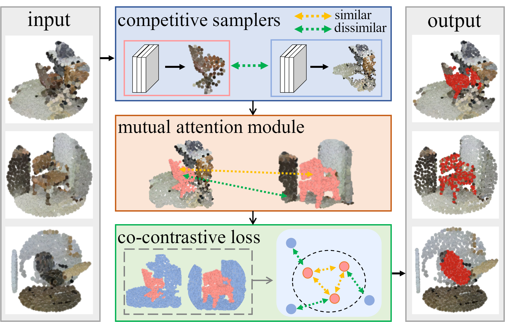
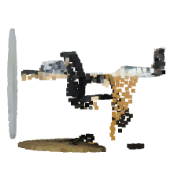
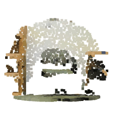
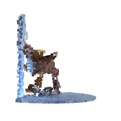
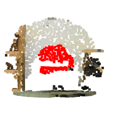
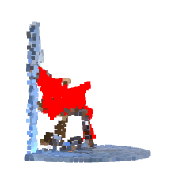

# Unsupervised Point Cloud Object Co-segmentation by Co-Contrastive learning and Mutual Attention Sampling

This repository is the implementation of ICCV 2021 paper (Oral): **Unsupervised Point Cloud Object Co-segmentation by using Co-Contrastive learning and Mutual Attention Sampling**.


##  Point Cloud Object Co-segmentation 
This paper presents a new task, point cloud object cosegmentation, aiming to segment the common 3D objects in a set of point clouds. We formulate this task as an object point sampling problem, and develop two techniques, the mutual attention module and co-contrastive learning, to enable it. The proposed method employs two point samplers based on deep neural networks, the object sampler and the background sampler. The former targets at sampling points of common objects while the latter focuses on the rest. The mutual attention module explores point-wise correlation across point clouds. It is embedded in both samplers and can identify points with strong cross-cloud correlation from the rest. After extracting features for points selected by the two samplers, we optimize the networks by developing the co-contrastive loss, which minimizes feature discrepancy of the estimated object points while maximizing feature separation between the estimated object and background points. Our method works on point clouds of an arbitrary object class. It is end-to-end trainable and does not need point-level annotations. It is evaluated on the ScanObjectNN and S3DIS datasets and achieves promising results.
| Input |  |   |  |
| -------- | -------- | -------- | -------- |
| Output   |      |      |      |
## Requirements

We strongly recommand using the [Docker image](https://github.com/itailang/SampleNet/tree/master/registration#installation) provided by SampleNet [Lang, et al. CVPR'2020](https://arxiv.org/abs/1912.03663).

To install requirements:

```setup
pip install -r requirements.txt
```

## Data Preparation
Download the ScanObjectNN [here](https://github.com/hkust-vgd/scanobjectnn) and S3DIS [here](https://shapenet.cs.stanford.edu/media/indoor3d_sem_seg_hdf5_data.zip).

And run the pre-process data to generate the S3DIS object dataset.

```python
python data_preprocess/parse_data.py
```


## Training

To train the model in the paper, run these commands, `obj` from 1 to 14 stands for each object category in ScanObjectNN:

```bash
python train.py --config=configs/scanobj.yaml --obj=1
```

## Test
Run the trained model for inference

```bash
python test.py --config=work_dirs/raw/scanobj/chair.yaml 
```

## Visualization
Run the command to genereate the GIF file in the README.md. Please note that only open3D with local monitor is supported.

```bash
python visualize.py
```
